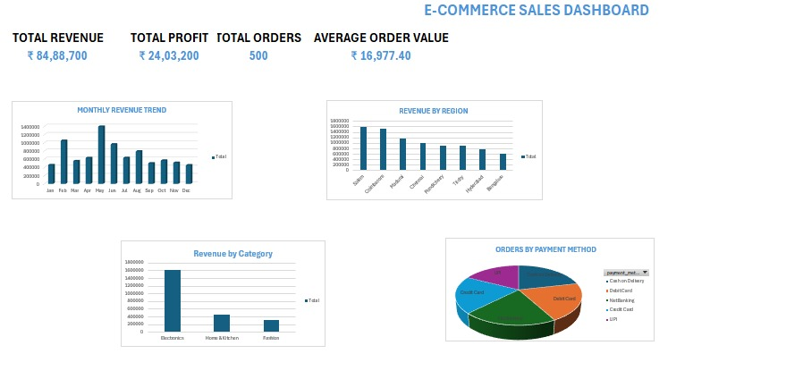

# E-Commerce Sales Analysis

## 📊 Project Overview

This project analyzes e-commerce sales data to understand revenue, profit, customer spending, product performance, regional sales, and payment preferences.

## 🛠️ Tools Used

- Microsoft Excel
- PivotTables
- PivotCharts
- Excel formulas

## 📌 Key KPIs

- Total Revenue: ₹84,88,700
- Total Profit: ₹24,03,200
- Total Orders: 500
- Average Order Value: ₹16,977.40
- Profit Margin: 28.31%

## 🔍 Key Insights

- Backpack was the best-selling product with 79 units sold.
- Electronics generated the highest revenue: ₹63,82,400.
- Electronics was also the most profitable category: ₹16,16,600.
- May recorded the highest monthly revenue: ₹13,91,200.
- Salem generated the highest regional revenue: ₹15,92,200.
- Cash on Delivery was the most-used payment method with 107 orders.
- Harini was the highest-spending customer with ₹7,59,900 in revenue.

## 📈 Dashboard

The Excel dashboard provides a visual overview of sales performance using KPI cards, charts, and PivotTables.

## 💡 Business Recommendations

- Focus on high-performing Electronics products.
- Investigate why sales peak in May.
- Study customer behavior in Salem to identify successful sales strategies.
- Analyze why UPI usage is lower than other payment methods.
- Promote high-performing products such as Backpack.

## 🎯 Conclusion

This project demonstrates my ability to clean and analyze data, calculate business KPIs, use PivotTables and PivotCharts, identify trends, and communicate business insights using Excel.

